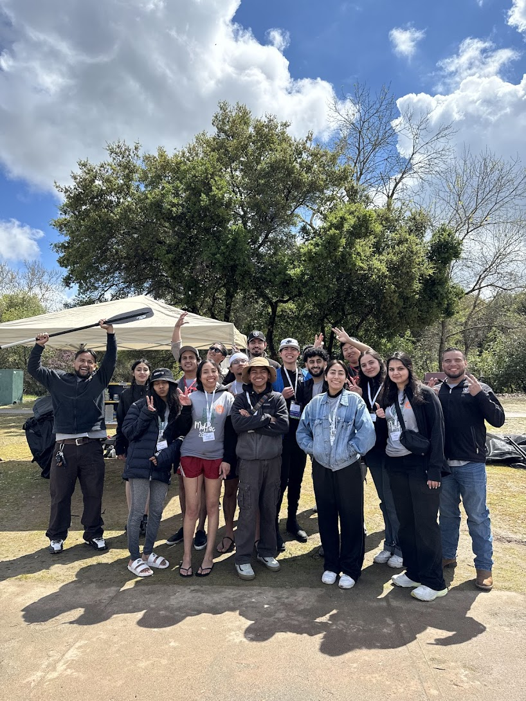

# SJSU Concrete Canoe Team Website

This is the official website for the San Jose State University Concrete Canoe Team. The website showcases the team's achievements, competitions, and provides a platform for donations and support.



## Table of Contents
- [Features](#features)
- [Project Structure](#project-structure)
- [Technologies Used](#technologies-used)
- [Getting Started](#getting-started)
  - [Prerequisites](#prerequisites)
  - [Installation](#installation)
  - [Environment Setup](#environment-setup)
- [Development Workflow](#development-workflow)
- [Managing Content](#managing-content)
  - [Adding/Removing Photos](#addingremoving-photos)
- [API & Serverless Functions](#api--serverless-functions)
- [Building for Production](#building-for-production)
- [Contributing](#contributing)
- [License](#license)
- [Acknowledgments](#acknowledgments)

## Features

- Modern, responsive design built with React.js and Tailwind CSS
- Animated UI components using Framer Motion
- Google Sheets integration for donation submissions
- Serverless API functions for secure data handling
- Mobile-friendly navigation
- Fast loading with code splitting and lazy loading

## Project Structure

```
SJSU-Concrete-Canoes-Website/
├── api/                  # Serverless API functions
│   ├── initialize-sheet.js  # Sets up Google Sheet with headers
│   └── submit-donation.js   # Handles donation form submissions
├── public/               # Static assets
│   ├── images/           # Website images and photos
│   │   └── placeholders/ # Placeholder images 
│   └── vite.svg          # Vite logo
├── src/                  # Source code
│   ├── assets/           # Static assets for import
│   ├── components/       # Reusable UI components
│   │   ├── Footer.tsx    # Site footer
│   │   └── Navbar.tsx    # Navigation bar
│   ├── hooks/            # Custom React hooks
│   ├── pages/            # Page components for each route
│   │   ├── About.tsx     # About page
│   │   ├── Competitions.tsx # Competitions page
│   │   ├── Contact.tsx   # Contact page
│   │   ├── Donate.tsx    # Donation page
│   │   ├── Home.tsx      # Home page
│   │   ├── NotFound.tsx  # 404 page
│   │   └── Team.tsx      # Team page
│   ├── styles/           # Global styles
│   ├── utils/            # Utility functions
│   │   └── googleSheetsService.ts # Google Sheets integration
│   ├── App.tsx           # Main application component
│   ├── App.css           # Global CSS
│   ├── index.css         # Global styles (Tailwind)
│   └── main.tsx          # Entry point
├── .env                  # Environment variables (do not commit sensitive data)
├── .env.example          # Example environment variables template
├── .env.local            # Local environment variables (do not commit)
├── .gitignore            # Git ignore patterns
├── package.json          # Project dependencies and scripts
├── tailwind.config.js    # Tailwind CSS configuration
├── tsconfig.json         # TypeScript configuration
├── vite.config.ts        # Vite configuration
└── vercel.json           # Vercel deployment configuration
```

## Technologies Used

- **Frontend:**
  - React.js 19
  - TypeScript
  - Tailwind CSS
  - Framer Motion (animations)
  - React Router (navigation)
  - Headless UI (accessible UI components)

- **Backend:**
  - Vercel Serverless Functions
  - Google Sheets API (for data storage)

- **Development:**
  - Vite (build tool)
  - ESLint (code linting)
  - Vercel CLI (local development server)

## Getting Started

### Prerequisites

- Node.js (v16 or higher)
- npm or yarn
- Git
- Vercel CLI (for API development)

### Installation

1. Clone the repository:
   ```bash
   git clone https://github.com/zahiraIi/SJSU-Concrete-Canoes-Website.git
   cd SJSU-Concrete-Canoes-Website
   ```

2. Install dependencies:
   ```bash
   npm install
   ```

3. Install Vercel CLI globally (if not already installed):
   ```bash
   npm install -g vercel
   ```

### Environment Setup

1. For local development with Google Sheets integration, you'll need to set up credentials:

   - Create a copy of `.env.example` and name it `.env.local`
   - Add your Google Sheet ID to the file:
     ```
     VITE_GOOGLE_SHEET_ID=your-spreadsheet-id
     VITE_INITIALIZE_SHEET=true
     ```

2. For complete Google Sheets integration (only required for donation form functionality):
   - Follow the detailed instructions in the `api/README.md` file
   - Create a Google Cloud project
   - Enable Google Sheets API
   - Create a service account with appropriate permissions
   - Generate credentials and add them to your environment variables

## Development Workflow

### Running the Frontend

Start the Vite development server:

```bash
npm run dev
```

This will start the development server at http://localhost:5173 (or another port if 5173 is already in use)

### Running the Backend (API Functions)

To develop and test the serverless functions locally:

```bash
npm run dev:api
```

This will start the Vercel development server that handles both the frontend and API functions.

### Common Development Tasks

- **Frontend Only Development**: When you're only working on the UI and don't need the API functionality, use `npm run dev`
- **Full Stack Development**: When you need to test API endpoints or Google Sheets integration, use `npm run dev:api`
- **Code Linting**: Run `npm run lint` to check for code style issues

## Managing Content

### Adding/Removing Photos

To add or update photos on the website:

1. **Prepare your images:**
   - Optimize images for web (compress to reduce file size)
   - Use PNG or JPG formats for best compatibility
   - Consider creating multiple resolution versions for responsive design

2. **Add images to the project:**
   - Place your images in the `public/images/` directory
   - For organization, you can create subdirectories (e.g., `team/`, `competitions/`)
   - For team member photos, follow the naming convention of existing images

3. **Use images in components:**
   - Reference images in your React components with:
     ```tsx
     
     ```
   - The path should be relative to the `public` directory

4. **Removing images:**
   - Delete the unused image files from the `public/images/` directory
   - Make sure to remove all references to these images in the code

5. **Best practices:**
   - Keep original high-resolution versions of images backed up elsewhere
   - For large team photos or competition images, include multiple resolutions
   - Use descriptive filenames (e.g., `2024-competition-first-place.jpg`)
   - Always provide meaningful alt text for accessibility

## API & Serverless Functions

This project uses Vercel serverless functions located in the `api/` directory to handle secure communication with Google Sheets.

### Available API Endpoints

- `/api/initialize-sheet`: Creates the necessary structure in your Google Sheet
- `/api/submit-donation`: Handles donation form submissions

### Setting Up Google Sheets Integration

Detailed instructions for setting up the Google Sheets API integration can be found in `api/README.md`.

**Important Security Note:** Never commit your Google API credentials to the repository. Always use environment variables or Vercel's secrets management.

## Building for Production

To create a production build:

```bash
npm run build
```

The build files will be located in the `dist` directory. You can preview the production build with:

```bash
npm run preview
```

## Contributing

1. Fork the repository
2. Create your feature branch (`git checkout -b feature/amazing-feature`)
3. Commit your changes (`git commit -m 'Add some amazing feature'`)
4. Push to the branch (`git push origin feature/amazing-feature`)
5. Open a Pull Request

### Development Workflow Best Practices

- Always create a new branch for your changes
- Keep pull requests focused on single features or fixes
- Write descriptive commit messages
- Update documentation when changing functionality
- Add tests for new features (if applicable)

## License

This project is licensed under the MIT License - see the LICENSE file for details.

## Acknowledgments

- San Jose State University
- SJSU Concrete Canoe Team members
- ASCE Student Chapter
